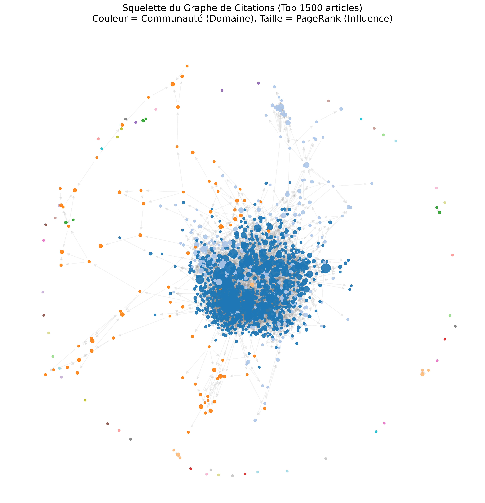

# Rapport de Projet : Recherche d'Information Scientifique & Analyse de Graphes

**Auteur :** Caujolle Vincent
**Date :** Janvier 2026
**Code:** https://github.com/ViCauj/BE2_datascience
**Cadre :** Bureau d'Étude Data Science n°2 - Recherche d'Information

---

## Résumé

Ce projet vise à concevoir un moteur de recherche d'articles scientifiques performant, capable de classer des documents par pertinence pour une requête donnée. Le défi réside dans la double nature de l'information disponible : le contenu textuel (souvent technique et ambigu) et la structure de citations (le graphe bibliographique).

Notre approche a suivi une progression logique : d'abord l'analyse lexicale, puis l'utilisation de modèles de langage neuronaux (Transformers) pour capturer la sémantique. Ensuite, nous avons intégré la structure du graphe, d'abord par un lissage local (Hybride), puis par une propagation globale (GCN). La solution retenue est une architecture d'Ensemble combinant un **GCN à 3 couches** et une méthode **TF-IDF**, atteignant un **AUC de 0.9726**.

---

## 1. Introduction et Problématique

La Recherche d'Information dans le domaine scientifique est une tâche ardue. Contrairement à la recherche web grand public, les requêtes sont souvent longues, constituées de termes techniques précis, et les documents pertinents peuvent utiliser un vocabulaire différent pour décrire le même concept. Ce problème est connu sous le nom de **fossé sémantique** (*semantic gap*).

Pour résoudre ce problème, nous disposons de deux leviers :
1.  **Le Contenu Textuel :** Titres et résumés (*abstracts*) des articles.
2.  **La Structure de Citations :** Le réseau bibliographique reliant les articles.

L'objectif de ce travail est de construire, évaluer et optimiser une chaîne de traitement capable de maximiser la métrique **AUC-ROC** (Area Under the Receiver Operating Characteristic Curve) sur un jeu de données compétitif.

---

## 2. Analyse Exploratoire et Prétraitement

### 2.1. Prétraitement des données
Pour garantir la cohérence des comparaisons entre nos différents modèles, une chaîne de traitement unique a été appliquée aux données brutes (JSONL) :
* **Enrichissement :** Concaténation des champs `title` et `text` (abstract) pour maximiser le contexte disponible pour les modèles.
* **Normalisation :** Passage en minuscules (*lowercasing*) pour uniformiser le vocabulaire.
* **Filtrage :** Suppression de la ponctuation et des mots-vides (*stop-words*) anglais courants (ex: "the", "is", "at") qui n'apportent pas d'information discriminante.

### 2.2. Exploration Thématique (LDA)
Avant de nous lancer dans le classement (*ranking*) des documents, nous avons cherché à comprendre la structure thématique latente du corpus. Nous avons utilisé l'algorithme **Latent Dirichlet Allocation (LDA)** via la classe `TopicModeling`.

Cette méthode statistique non supervisée permet de regrouper les documents en "sujets" basés sur la co-occurrence des mots. L'analyse a révélé des clusters thématiques cohérents (ex: un cluster autour de "neural networks/learning", un autre autour de "energy/power systems").
Bien que le LDA ne soit pas adapté à la recherche précise de documents (il est trop grossier pour le ranking fin), cette étape a permis de valider la cohérence sémantique du corpus et de confirmer que les mots-clés sont bien discriminants par domaine.

### 2.3. Analyse Structurelle (Graphe)
Le corpus a été modélisé comme un graphe orienté $G=(V, E)$ via la classe `CitationGraph`. L'analyse exploratoire a révélé une forte structure communautaire.

La visualisation du squelette du graphe (ci-dessous) montre clairement que les articles ne se citent pas au hasard : ils forment des grappes denses. Cela valide notre hypothèse d'**homophilie** : un article pertinent a une forte probabilité d'être connecté à d'autres articles pertinents.

*Figure 1 : Visualisation des 500 articles les plus connectés (Squelette du graphe). On observe des clusters distincts correspondant aux différents domaines scientifiques.*

---

## 3. Méthodologie : Une approche incrémentale

Nous avons structuré notre développement en quatre phases distinctes, chaque modèle visant à combler les lacunes du précédent.

### 3.1. Phase 1 : Approches Lexicales (La Baseline)
Nous avons débuté par des modèles classiques basés sur la fréquence des mots.
* **`BagOfWordsCountSearchEngine` :** Utilise un simple comptage des termes. C'est la baseline absolue.
* **`BagOfWordsTfidfSearchEngine` :** Utilise la pondération TF-IDF pour pénaliser les termes trop fréquents dans le corpus et valoriser les termes rares spécifiques.

**Limites :** Ces modèles (AUC ~0.80) échouent dès qu'il n'y a pas de correspondance exacte de mots. Ils ne "comprennent" pas le texte.

### 3.2. Phase 2 : Approche Sémantique (Le saut technologique)
C'est la raison d'être de ce projet : combler le fossé sémantique. Nous avons implémenté le **`DenseSearchEngine`**.

Cette approche utilise des techniques de **Deep Learning** modernes, spécifiquement les Transformers (**Sentence-BERT** `all-MiniLM-L6-v2`). Contrairement aux méthodes précédentes qui voient le texte comme un sac de mots, ce modèle transforme chaque phrase en un vecteur dense de 384 dimensions.
* **Pourquoi c'est crucial :** Dans cet espace vectoriel, la distance entre deux points reflète leur similarité de sens. Le modèle rapproche naturellement "Deep Learning" et "Neural Networks", même s'ils ne partagent aucun mot.
* **Résultat :** Un bond massif de performance (AUC ~0.95), prouvant que la compréhension du sens est prioritaire.

### 3.3. Phase 3 : L'Apport de la Structure (De l'Hybride au GCN)
Le modèle sémantique est puissant mais traite chaque document isolément. Or, l'information de citation est un signal fort de validation par les pairs. Nous l'avons intégrée en deux temps.

#### A. L'approche Hybride (Lissage local)
Dans un premier temps, nous avons conçu le **`HybridSearchEngine`**. L'idée était simple : corriger le vecteur d'un article en utilisant ceux de ses voisins directs (1 saut).
* **Mécanisme :** $V_{article} = \alpha V_{article} + (1-\alpha) V_{voisins}$.
* **Intérêt :** Si le modèle sémantique hésite sur un article, le fait qu'il cite des articles très pertinents va "tirer" son vecteur vers la zone de pertinence. Cela lisse le bruit et améliore la robustesse.

#### B. La Généralisation GCN (Propagation profonde)
Pour aller plus loin, nous sommes passés d'un lissage local à une propagation globale avec le **`GCNSearchEngine`** (Graph Convolutional Network).
Au lieu de regarder juste les voisins immédiats, nous propageons l'information sur **3 sauts** ($k=3$).
* **Choix des 3 sauts :** Bien que la littérature suggère souvent 2 sauts, nos expérimentations ont montré qu'un GCN à 3 couches maximisait l'AUC sur ce corpus. Cela permet de capturer des effets de communauté plus larges (ex: relier deux articles qui ne se citent pas mais appartiennent à la même école de pensée via des intermédiaires).

### 3.4. Phase 4 : Stratégie Finale (L'Ensemble)
Le GCN à 3 sauts est excellent pour la vue d'ensemble, mais risque parfois de trop "lisser" l'information (oversmoothing), perdant la trace de mots-clés très spécifiques présents dans la requête.

Pour notre soumission finale, nous avons créé l'**`EnsembleSearchEngine`**, qui combine linéairement les deux signaux extrêmes :
$$Score_{Final} = 0.85 \times Score_{GCN\_3hops} + 0.15 \times Score_{TFIDF}$$

Le TF-IDF agit ici comme un "mécanisme d'attention" lexical, réinjectant de la précision sur les termes exacts que le lissage par graphe aurait pu diluer.

---

## 4. Résultats et Discussion

### 4.1. Synthèse des performances (Validation 700 requêtes)

| Modèle | Précision | Rappel | F1-Score | **AUC-ROC** | Analyse |
| :--- | :--- | :--- | :--- | :--- | :--- |
| **BagOfWordsCount** | 0.5877 | 0.5968 | 0.5915 | 0.7985 | Baseline limitée par le vocabulaire. |
| **BagOfWordsTfidf** | 0.6131 | 0.6228 | 0.6171 | 0.8048 | Légère amélioration (+ stat. robuste). |
| **Dense (BERT)** | 0.8031 | 0.8154 | 0.8082 | 0.9556 | **Rupture technologique.** Gain sémantique majeur. |
| **Hybrid (1-hop)** | 0.8217 | 0.8341 | 0.8268 | 0.9647 | Le graphe local corrige les erreurs sémantiques. |
| **GCN (3-hops)** | 0.8451 | 0.8577 | 0.8503 | 0.9724 | La propagation profonde capture les communautés. |
| **Ensemble (Final)** | **0.8477** | **0.8603** | **0.8529** | **0.9726** | **Meilleur résultat.** |

### 4.2. Analyse Critique

1.  **La primauté de la sémantique :** Le gain le plus spectaculaire (+15 points AUC) a été obtenu en passant du lexicale au sémantique (`Dense`). Cela valide l'hypothèse que la compréhension du sens est le pré-requis absolu.
2.  **La structure raffine le contenu :** Une fois le sens capturé, le graphe permet d'atteindre l'état de l'art (+1.5 points). La progression de `Hybrid` à  `GCN` montre bien que l'information n'est pas seulement locale (voisins) mais structurelle (communauté). L'utilisation de **3 sauts** s'est avérée payante, indiquant que la pertinence se diffuse loin dans le réseau de citations.
3.  **L'échec du Neural Re-ranking :** Nous avons tenté une approche de *Re-ranking* avec un **Cross-Encoder** (Neural Networks). Contre toute attente, l'AUC a chuté à ~0.83.
    * *Explication :* Le Cross-Encoder est un modèle purement textuel très puissant, mais il ignore le graphe. En réordonnant la liste fournie par le GCN uniquement sur la base du texte, il a "cassé" l'ordre optimal établi par les citations. Cela confirme que pour ce dataset, **l'information structurelle prime sur la finesse textuelle ultime**.

---

## 5. Conclusion

Ce projet a permis de construire un système de recherche d'information complet, partant de l'exploration des données (LDA) jusqu'à une solution compétitive.

Notre parcours a mis en lumière la hiérarchie des informations dans un corpus scientifique :
1.  Les mots-clés fournissent une base (AUC 0.80).
2.  Le sens (embeddings) fournit la compréhension (AUC 0.95).
3.  Le graphe (citations) fournit la validation et le contexte (AUC 0.97).

La solution finale, un ensemble **GCN (3 sauts) + TF-IDF**, démontre qu'une combinaison intelligente de méthodes statistiques classiques et de Deep Learning géométrique offre les meilleurs résultats, atteignant un AUC de **0.9726**.
